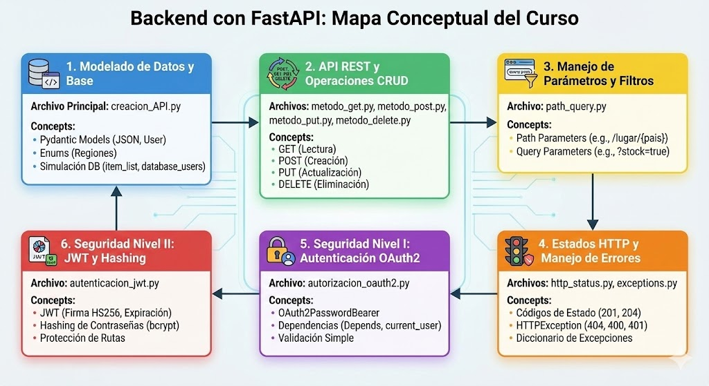

# ⚡️ FastAPI – Curso de Backend

<p align="center">
  
</p>

 En este repositorio vas a encontrar todo el contenido principal para aprender cómo manejar un sistema Backend en FastAPI, uno de los frameworks más rápidos y modernos para construir APIs con Python. El objetivo es documentar el progreso de los fundamentos necesarios, con un enfoque en la seguridad avanzada (JWT + Hashing) y la arquitectura modular usada en entornos profesionales.

## 🧭 Tabla de Contenidos

1. [🚀 Introducción a FastAPI](#🚀-introducción-a-fastapi)  
2. [📁 Estructura del Proyecto](#📁-estructura-general-del-proyecto)  
3. [⚙️ Instalación y Dependencias](#⚙️-instalación-y-ejecución)  
4. [Módulos y Contenido del Curso](#módulos-y-contenidos-del-curso)  
5. [Ejercicios y Proyectos Incluidos](#ejercicios-incluidos)  

---

## 🚀 Introducción a FastAPI

FastAPI es un framework de Python diseñado para crear APIs de manera sencilla y con performance alta.  
Se basa en:

- Python moderno (type hints)  
- Pydantic (modelado de datos)  
- Starlette (manejo de requests ultrarrápido)  
- Swagger UI integrado  

Este repositorio recopila ejercicios realizados para aprender cada parte del framework de forma progresiva.

<p align="center">
  
</p>

---

## 📁 Estructura General del Proyecto

```txt
Backend/
│
├── Examples/
│   ├── example_01/
│   ├── example_02/
│   ├── example_03/
│   └── …
│ 
├── Exercises/
│   ├── exercise_01/
│   ├── exercise_02/
│   ├── exercise_03/
│   ├── exercise_04/
│   └── …
│
├── Routers/
│   ├── metodo_get.py
│   ├── metodo_post.py
│   ├── metodo_put.py
│   ├── metodo_delete.py
│   ├── path_query.py
│   ├── http_status.py
│   ├── autorizacion_oauth2.py
│   └── autenticacion_jwt.py
│
├── Static/
│   └── Images/
│
├── main.py
└── README.md
```

Cada carpeta contiene módulos independientes del curso, permitiendo un aprendizaje progresivo y ordenado.

---

## ⚙️ Instalación y Ejecución

1. Clonar el repositorio:
```txt
git clone https://github.com/LorenzoPoggi/FastAPI-Backend
```

2. Crear un entorno virtual:
```txt
python3 -m venv venv
```

3. Activarlo:
```txt
source venv/bin/activate   
```

4. Instalar dependencias generales del curso:
```txt
pip install fastapi[standard] passlib[bcrypt] python-jose
```

5. Ejecutar la API:
```txt
fastapi dev main.py
```

6. Documentación automática disponible en:
```txt
http://localhost:8000/docs
```

---

## Módulos y Contenidos del Curso

### ✓ Rutas y Métodos HTTP
- GET, POST, PUT, DELETE
- Parámetros de ruta
- Validación automática con Pydantic

### ✓ Path y Query Parameters
- Parámetros dinámicos (`/items/1`)
- Parámetros opcionales (`?price_max=100`)

### ✓ Manejo de HTTP Status
- `status_code`
- `HTTPException`
- Errores informativos para cada operación

### ✓ Routers
- Modularización profesional
- Uso de `include_router()`

### ✓ Archivos Estáticos
- Montaje de contenido estático mediante `StaticFiles`

### ✓ CRUD Completo
- Base de datos simulada con listas
- Registro, consulta, modificación y eliminación

### ✓ Autenticación OAuth2 (Password Flow)
- Login con usuario y contraseña
- Tokens tipo Bearer

### ✓ Hashing de Contraseñas (bcrypt)
- Verificación de contraseñas seguras

### ✓ JWT (JSON Web Tokens)
- Generación de tokens con expiración
- Decodificación y validación segura

### ✓ Autorización por Roles
- Permisos para CEO vs empleados
- Rutas protegidas con dependencias

---

## Ejercicios incluidos

### **Ejercicio 1 – Sistema de Productos**  
CRUD básico con estructura simple y Pydantic.

### **Ejercicio 2 – Gestión de Empleados**  
CRUD completo + manejo profesional de HTTP Status.

### **Ejercicio 3 – Sistema de Usuarios**  
Autenticación con OAuth2, dependencias y roles.

### **Ejercicio 4 – Inventario Autenticado**  
JWT + hashing + permisos + rutas protegidas + CRUD.
